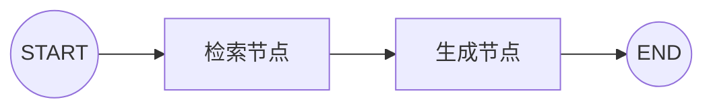
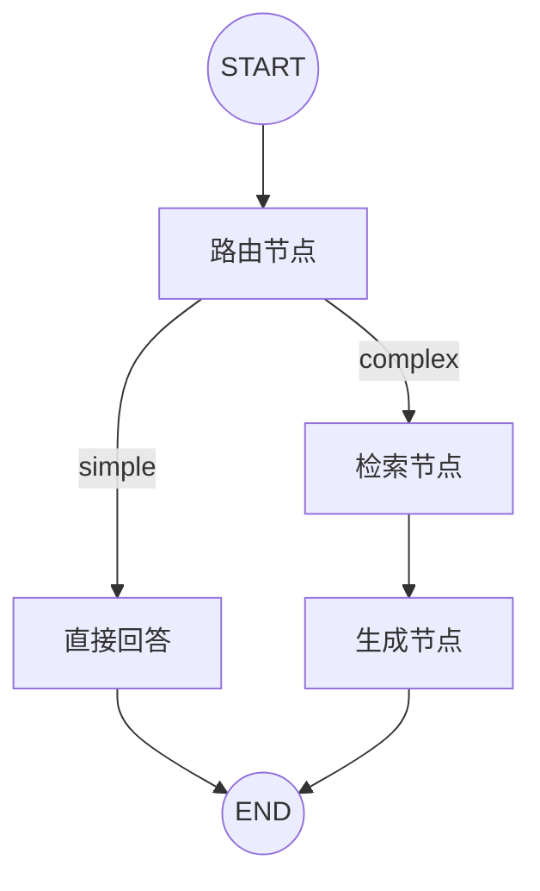
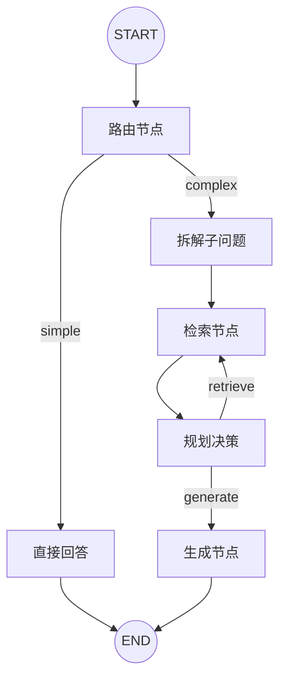
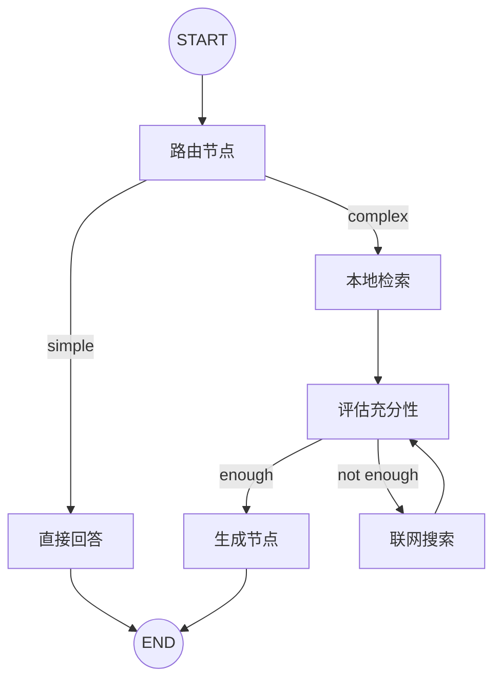

# 第 19 章 · Agentic RAG：基于 LangGraph 实现大模型自主决策的 RAG 闭环系统

> **关键词**：查询路由、子问题拆解、多跳检索、规划决策、联网兜底、LangGraph StateGraph

## 概述

Agentic RAG 是传统 RAG 的进化形态。朴素 RAG 只是"检索 → 生成"的两步流水线，而 Agentic RAG 让大模型在检索过程中拥有**自主决策能力**——它能判断是否需要检索、该以什么方式检索、检索到什么程度才足够、是否该借助外部工具兜底。

本章通过 4 个递进式示例，从零搭建一个完整的 Agentic RAG 闭环系统（以《天龙八部》小说问答为场景，Milvus 向量库 + LangGraph 编排），逐步揭示大模型如何从"被动执行者"转变为"主动决策者"。

## 示例矩阵

| # | 文件 | 能力层级 | 大模型角色 |
|---|------|----------|------------|
| 1 | `naive-rag.mjs` | 🟢 基础 RAG | 纯生成器 |
| 2 | `rag-query-router.mjs` | 🟡 查询路由 | 简单/复杂分流器 |
| 3 | `rag-multihop.mjs` | 🟠 多跳 RAG | 子问题拆解 + 多轮检索 + 规划决策 |
| 4 | `rag-webfallback.mjs` | 🔴 联网兜底 | 充分性评估 + 外部工具调度 |

---

## 示例 1：基础 RAG — 检索 → 生成

**文件**：`src/advanced-rag/src/naive-rag.mjs`

最朴素的 RAG 形态：用户提问 → 向量检索 → 拼接上下文 → 大模型生成。所有决策由代码写死，模型只是生成器。

### 状态定义

```js
const GraphState = Annotation.Root({
  question: Annotation,    // 用户问题
  k: Annotation,           // 检索 Top-K
  documents: Annotation,    // 检索结果
  generation: Annotation,   // 模型回答
})
```

### 图结构



### 核心节点

**retrieve（检索节点）**：调用 Milvus 的 `similaritySearchWithScore` 做余弦相似度检索，返回 Top-K 文档片段（含章节号、原文内容、相似度分数）。

**generate（生成节点）**：将检索到的文档拼接为上下文，注入 Prompt 模板，流式输出回答。Prompt 中明确要求"综合多个片段""引用原文"。

### 运行示例

```bash
cd src/advanced-rag
node src/naive-rag.mjs
```

默认问题：`阿朱的结局是什么？`

---

## 示例 2：查询路由 — 模型自主判断是否需要检索

**文件**：`src/advanced-rag/src/rag-query-router.mjs`

引入第一个决策点：**不是所有问题都需要检索**。模型先判断问题的复杂度，然后再决定走"直接回答"还是"先检索再回答"。

### 新增能力

- **路由节点**：用 `withStructuredOutput` + Zod Schema 让模型输出 `{ strategy: "simple" | "complex", reason: string }`
- **条件边**：根据 strategy 动态路由到 `direct_answer` 或 `retrieve`

### 图结构



### 路由规则

```
simple：常识问答、简短定义、无需具体小说细节
complex：需要《天龙八部》具体情节、人物关系、章节事实、原文细节
```

### 运行示例

```bash
node src/rag-query-router.mjs
```

默认问题：`雁门关事件的主谋，他的儿子最终结局是什么？`

启动后可看到日志输出：
```
路由策略: complex (需要天龙八部具体情节和人物关系)
---RETRIEVE---
检索命中: 5 条
---RAG_GENERATE---
```

---

## 示例 3：多跳 RAG — 子问题拆解 + 多轮检索 + 规划决策

**文件**：`src/advanced-rag/src/rag-multihop.mjs`

复杂问题往往不能一步到位。比如"四大恶人排行第二的是谁？此人之子在身世揭晓前，其生父在武林中的公开身份是什么？"——需要先查四大恶人排行、再查其子身世、再查其生父身份，形成三层推理链。

### 新增能力

- **子问题拆解（decompose）**：模型将原问题拆为有序子问题序列（禁止使用指代词，每句独立可检索）
- **多轮检索循环**：按子问题顺序逐条检索，用 `mergeUnique` 去重合并
- **规划决策（plan_next_step）**：每轮检索后模型自主判断"继续检索"还是"够了我能回答了"
- **安全兜底**：通过 `maxRetrievals` 和剩余子问题数做硬性上限，防止无限循环

### 状态定义（完整）

```js
const GraphState = Annotation.Root({
  question: Annotation,       // 原始问题
  k: Annotation,              // 检索 Top-K
  strategy: Annotation,       // simple | complex
  routeReason: Annotation,     // 路由原因
  subQuestions: Annotation,    // 拆解后的子问题数组
  nextSubIdx: Annotation,      // 下一轮要检索的子问题下标
  documents: Annotation,       // 累计检索结果
  currentQuery: Annotation,    // 当前轮查询文本
  retrievalCount: Annotation,  // 已检索轮数
  maxRetrievals: Annotation,   // 最大检索轮数上限
  plannedNext: Annotation,     // 模型决策：retrieve | generate
  generation: Annotation,      // 最终回答
})
```

### 图结构



### 决策逻辑

```
plan_next_step 的 Prompt 包含：
  - 原始问题
  - 子问题序列（标注已检索/未检索状态）
  - 已检索轮数 & 剩余轮数
  - 已召回文档摘要
输出：{ nextAction: "retrieve" | "generate", reason }

硬性规则：
  - 剩余子问题为 0 → 强制 generate
  - 已达 maxRetrievals → 强制 generate
```

### 运行示例

```bash
node src/rag-multihop.mjs
```

默认问题：`《天龙八部》中「四大恶人」排行第二的是谁？此人之子在身世揭晓前，其生父在武林中的公开身份是什么？`

运行日志示例：
```
---DECOMPOSE_QUESTION---
拆解 3 条子问题
  [1] 《天龙八部》中四大恶人按排名分别是谁
  [2] 四大恶人中排行第二者是谁
  [3] 四大恶人排行第二者的儿子在身世揭晓前，其生父在武林中的公开身份是什么
---RETRIEVE (第 1 轮，子问题 1/3)---
查询: 《天龙八部》中四大恶人按排名分别是谁
[决策] plannedNext=retrieve
---RETRIEVE (第 2 轮，子问题 2/3)---
...
[决策] plannedNext=generate
```

---

## 示例 4：联网兜底 — 本地不够就上网查

**文件**：`src/advanced-rag/src/rag-webfallback.mjs`

本地知识库覆盖不到的信息怎么办？比如用户问"《天龙八部》2013 版电视剧中雁门关事件出现在哪几集？"——向量库里只有小说原文，没有电视剧信息。此时引入联网搜索作为兜底。

### 新增能力

- **充分性评估（evaluate）**：检索本地文档后，模型判断是否足以回答问题，并给出缺失信息点
- **联网搜索（web_search）**：通过 Tavily API 做互联网搜索
- **二次评估**：联网后再次评估，确保兜底数据有效才生成回答

### 图结构



### 关键设计

- `evaluate_local` 节点在本地检索和联网搜索后会**被复用两次**：第一次判断本地是否够用，第二次判断联网补充后是否够用
- 联网搜索仅触发一次（`web_search` → `evaluate_local` 后，若已带 web 结果则直接 `generate`）
- Tavily 搜索返回结构化结果：综合答案 + 引用链接 + 摘要 + 发布时间

### 运行示例

```bash
node src/rag-webfallback.mjs
```

默认问题：`请回答《天龙八部》小说里"雁门关事件"的主谋是谁，并说明其儿子的最终结局；另外请补充：在《天龙八部》2013 版电视剧中，这段"雁门关事件"主要出现在哪几集？请给出可核对的来源链接。`

---

## 环境配置

所有示例共享 `.env` 配置（从 `src/advanced-rag/utils/config.util.mjs` 自动向上查找）：

```bash
# 大模型配置
MODEL=deepseek-chat
API_KEY=sk-xxx
BASE_URL=https://api.deepseek.com/v1

# Embedding 配置（阿里云 DashScope）
EMBEDDING_API_KEY=sk-xxx
EMBEDDING_MODEL=text-embedding-v4
EMBEDDING_DIM=1024

# Milvus 向量库
MILVUS_ADDRESS=localhost:19530
EBOOK_COLLECTION_NAME=tianlongbabu_chunks

# 联网搜索（仅示例 4 需要）
TAVILY_API_KEY=tvly-xxx
```

## 工具依赖

| 工具 | 用途 | 版本 |
|------|------|------|
| `@langchain/langgraph` | 状态图编排 | ^1.2.9 |
| `@langchain/openai` | ChatOpenAI 模型调用 | ^1.4.4 |
| `@langchain/community` | Milvus 向量存储集成 | ^1.1.27 |
| `@langchain/tavily` | Tavily 联网搜索 | ^1.2.0 |
| `zod` | 结构化输出 Schema | ^4.3.6 |

## 设计哲学

整个 Agentic RAG 体系贯穿一条核心原则：**把决策权从硬编码规则中释放出来，交给模型自主判断**。

| 决策点 | 传统方式 | Agentic 方式 |
|--------|----------|--------------|
| 是否检索 | if-else 关键词匹配 | 模型 Semantic Router |
| 怎么检索 | 固定 query 拼接 | 模型拆解子问题序列 |
| 何时停止 | 固定轮数 | 模型评估充分性 |
| 检索不够 | 报错或空答 | 模型调度外部工具兜底 |

但自主不等于放任——每个决策点都有硬性上限（`maxRetrievals`、剩余子问题数、联网只触发一次），确保系统始终可控。

## 学习建议

1. **先跑起来**：按顺序运行 4 个示例，观察日志中模型的决策过程
2. **对比理解**：重点关注每个示例比前一个多了什么节点、什么决策
3. **换问题试**：修改 `main()` 中的 `question` 变量，换不同复杂度的问题测试
4. **看 Mermaid 图**：每个示例启动时都会打印图结构，复制到 [mermaid.live](https://mermaid.live) 可视化

## 扩展方向

- 将联网搜索替换为其他外部工具（数据库查询、API 调用）
- 引入检索质量评分，对低质量结果做二次检索
- 给评估节点增加自信分阈值，分数不够自动触发兜底
- 结合第 12 章的 Runnable 链，将检索策略做成可插拔的 Strategy 模式
