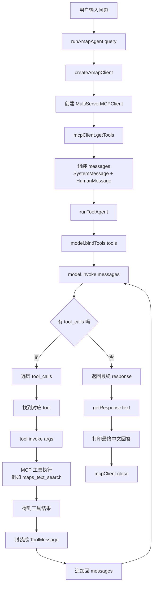
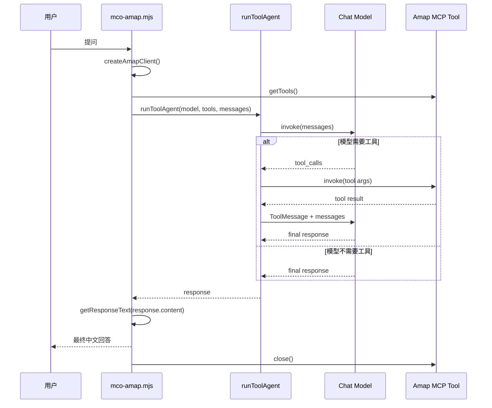

# mco-amap Agent + MCP 工具调用流程图

对应文件：

- `src/mco-amap.mjs`
- `src/tool-runner.mjs`

## Flowchart

## Sequence Diagram

## 简化记忆

1. 用户提问
2. Agent 连接 MCP 地图工具
3. Agent 把工具交给模型
4. 模型决定是否调用工具
5. 工具结果回填给模型
6. 模型输出最终答案
7. Agent 关闭 MCP 连接
